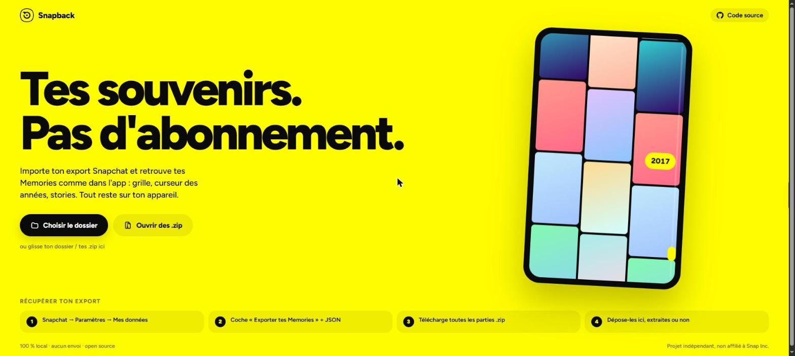
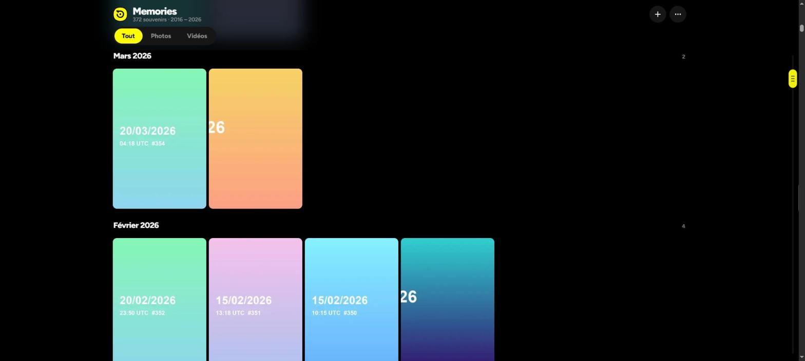

<p align="center">
  
</p>

<h1 align="center">Snapback</h1>

<p align="center">
  <b>Your Snapchat Memories, at home.</b><br/>
  An open-source, 100% local viewer for your Snapchat data export.<br/>
  Same feel as the app (grid, year scrubber, stories), no subscription, nothing uploaded.
</p>

<p align="center">
  
</p>

> 🇫🇷 [Version française plus bas](#-en-français)

## Why

In 2025 Snapchat started charging for Memories storage above 5 GB. You can export everything for free
(*Settings → My Data*), but what you get is a pile of zip files full of names like
`2019-06-01_3F2A…-main.mp4`, captions split into separate `-overlay.png` files, and dates that only live
in a JSON file. Snapback turns that pile back into something that feels like Memories.

## Features

- **Drop your export as-is**: the extracted folder, the `mydata~….zip` parts (several at once), or a mix.
  Archives are read in place, nothing is unzipped to disk.
- **Correct dates**: exact time and GPS come from `memories_history.json`; it falls back to the file name,
  then EXIF, then the file date.
- **Captions and stickers**: each `-overlay.png` is layered over its photo or video, in the grid and in
  the viewer. You can toggle it, and download a photo with the caption burned in.
- **Snapchat-style browsing**: grid grouped by month, a yellow **year scrubber** you can drag through
  the years, photo/video tabs.
- **Flashbacks**: "On this day" story bubbles, which auto-advance like stories.
- **Full-screen viewer**: tap left or right, swipe, swipe down to close, hold to pause, plays videos with sound.
  Keyboard: `← →`, `Space`, `M` (mute), `T` (caption), `Esc`.
- **Fast with large libraries**: a virtualized grid, thumbnails generated on demand and cached in IndexedDB.
- **Remembers your folder** (Chrome, Edge, Brave and other Chromium browsers): reopen the library in one click.
- **Private by design**: no server, no analytics, no network calls. Your files never leave your device.
- **Installable app (PWA)**: add it to your home screen and it opens full screen, works offline, and on iPhone
  your data is kept safe from Safari's 7-day storage purge.
- Responsive, light and dark themes, French and English UI.

<p align="center">
  
</p>

## Get your Snapchat export

1. Snapchat → **Settings → My Data** (or [accounts.snapchat.com](https://accounts.snapchat.com) → *My Data*).
2. Tick **Export your Memories** and **Export JSON files**, then pick the date range "All time".
3. When the email arrives, download **every** `.zip` part.
4. Open Snapback and drop the zips (or the extracted folder).

## Install it on your phone

Open **https://pinutss.github.io/snapback/** and:

- **iPhone / iPad**: tap *Share* (sometimes inside the ••• menu), then **Add to Home Screen**.
- **Android**: tap **Install app** on the page (or *⋮ → Install app* in Chrome).
- **Desktop Chrome / Edge**: click **Install app**, or the install icon in the address bar.

It then runs like a regular app, offline included. The service worker only caches the app itself;
your photos and videos never go through it.

## Run it

```bash
git clone https://github.com/Pinutss/snapback.git
cd snapback
npm install
npm run dev        # http://localhost:5173
npm run build      # static site in dist/
```

The build is a plain static site with relative paths, so you can host `dist/` anywhere: GitHub Pages
(a workflow is included in `.github/workflows/deploy.yml`), Netlify, a USB stick, and so on.

**Browser support**: Chromium browsers get the best experience (folder picker and remembered library).
Firefox and Safari work too, but you have to pick the folder again on each visit. HEIC photos only display in Safari.

## How it works

| File | Role |
| --- | --- |
| `src/lib/sources.ts` | Reads folders, files, drag & drop and zip archives as lazy `SourceFile`s |
| `src/lib/parse.ts` | Pairs `-main` / `-overlay`, matches media to `memories_history.json` (by media id, then by day), resolves dates |
| `src/lib/thumbs.ts` | Thumbnail generation (photo + video frame + overlay), cancellable LIFO queue, IndexedDB cache |
| `src/components/YearScrubber.tsx` | Drag-through-time fast scroller |
| `src/components/Viewer.tsx` | Full-screen viewer and stories, with gestures |
| `pwa/sw.js` + `vite.config.ts` | Offline service worker; the build injects the list of files to precache |

Stack: React, TypeScript, Vite, Motion, TanStack Virtual, zip.js, exifr, zustand.

## Contributing

Issues and PRs are welcome. If Snapchat changes its export format, an anonymized file listing
(just the names) plus a few redacted lines of `memories_history.json` is the most useful thing to attach.

## License

[MIT](LICENSE). Snapback is an independent project. It is not affiliated with, endorsed by, or sponsored
by Snap Inc. "Snapchat" is a trademark of Snap Inc.

---

## 🇫🇷 En français

**Snapback** affiche tes Memories Snapchat en local, comme dans l'app. Depuis que Snapchat fait payer
le stockage au-delà de 5 Go, tu peux exporter tes données gratuitement, mais tu récupères surtout une
pile de zips illisibles. Snapback les transforme en une vraie galerie :

- Tu déposes l'export tel quel : le dossier extrait ou les `.zip`, même plusieurs à la fois.
- Les dates et heures sont exactes et les lieux sont retrouvés grâce à `memories_history.json`.
- Les textes, stickers et dessins (`-overlay.png`) sont replacés sur les photos et vidéos.
- La grille est classée par mois, avec le **curseur des années** jaune à faire glisser.
- Les flashbacks « Ce jour-là » se regardent en stories.
- La visionneuse plein écran gère les gestes (tap, swipe, glisser vers le bas pour fermer, appui long
  pour mettre en pause). Tu peux aussi télécharger une photo avec son texte.
- **Rien n'est envoyé nulle part.** Tout se passe dans ton navigateur.
- **S'installe comme une app** : sur iPhone, *Partager → Sur l'écran d'accueil* ; sur Android, bouton
  « Installer l'app ». Elle s'ouvre en plein écran et marche hors ligne.

**Récupérer l'export** : Snapchat → Paramètres → Mes données → coche « Exporter tes Memories » et
« Exporter les fichiers JSON » → télécharge toutes les parties `.zip` → dépose-les dans Snapback.

**Lancer en local** : `npm install` puis `npm run dev`.
